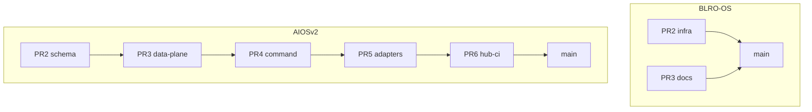

# 41 — C-Stack W1–W12 주차별 상세 계획서 (PR 포함)

> **작성일:** 2026-06-22  
> **기준:** [33-C방향](33-C방향-통합-전략-및-P0-결정서.md) · [31-티켓체크리스트](31-CEO-지시용-티켓-체크리스트.md) · [36-E2E](36-E2E-SCENARIO-001.md)  
> **일정:** 9~12주 표준 MVP (W1=P0, W2–3=P1, W4–6=P2, W7–8=P3, W9–10=P4, W11=P5, W12=P6)  
> **진입점:** `http://localhost:3110/command`

---

## 0. 현재 위치 (2026-06-22, main 기준)

| 구분 | 상태 |
|------|------|
| **기술 스모크** | health 8/8, E2E 1–4 스크립트 PASS |
| **제품 통합** | P1 본작업 미완 — AppShell 단일화·실데이터 브리핑 필요 |
| **BLRO-OS main** | `9a6a20f` — PR [#2](https://github.com/whelp99-code/BLRO-OS/pull/2)·[#3](https://github.com/whelp99-code/BLRO-OS/pull/3) **MERGED** |
| **AIOSv2 main** | `c994213` — PR #2 MERGED; #3–#6 로컬 스택 머지 후 push (#4–#6 GitHub closed superseded) |
| **원본 브랜치** | `cursor/c-stack-p0-p6-implementation` — **삭제됨** (remote·local) |
| **현재 주차** | **W1 (P0) ~85%** — W2+ 제품 본작업 미착수 |
| **Done 범례** | ✅ 완료 · 🟡 스캐폴딩 · ☐ 미착수 → [41-티켓-전량-상세](41-티켓-전량-상세.md) |
| **주차별 상세** | [docs/41-weeks/](41-weeks/README.md) W01–W12 개별 문서 |

---

## 1. PR 맵 (리뷰 단위) — **머지 완료**

### BLRO-OS (`whelp99-code/BLRO-OS`)

| PR | 브랜치 | 범위 | 상태 |
|----|--------|------|------|
| [#2](https://github.com/whelp99-code/BLRO-OS/pull/2) | `cursor/c-stack-infra-health` | compose, HEALTH-REGISTRY, c-stack-health | **MERGED** |
| [#3](https://github.com/whelp99-code/BLRO-OS/pull/3) | `cursor/c-stack-strategy-docs` | 전략·ADR·runbook·e2e-scenarios | **MERGED** |

### AIOSv2_integration (`whelp99-code/AIOSv2_integration`)

| PR | 브랜치 | Phase | 상태 |
|----|--------|-------|------|
| [#2](https://github.com/whelp99-code/AIOSv2_integration/pull/2) | `cursor/schema-m1-m2` | P0 M1–M2 | **MERGED** |
| #3 | `cursor/data-plane-p2` | P2 | main `c994213` (로컬 머지) |
| #4 | `cursor/command-approval-p1` | P1 | main `c994213` (로컬 머지) |
| #5 | `cursor/adapters-p3-p5` | P3–P5 | main `c994213` (로컬 머지) |
| #6 | `cursor/hub-wiring-ci` | P0/P6 CI | main `c994213` (로컬 머지) |



---

## 2. 주차별 상세 (W1–W12)

### W1 — P0 기반 마무리

**목표:** 인프라·스키마·허브 기동, M3 앱 연동

| 담당 | 티켓 | 작업 | 산출 | PR |
|------|------|------|------|-----|
| 엔지니어 | P0-ENG-001 | `docker-compose.c-stack.yml` PG :5435, Redis :6382 | compose up | BLRO #2 |
| 엔지니어 | P0-ENG-002 | `c-stack-health.mjs` | 8/8 pass | BLRO #2 |
| 엔지니어 | P0-ENG-006 | M1 BLRO + M2 portal additive | migrate :5435 | AIOS #2 |
| 엔지니어 | P0-ENG-005 | :3110 기동, integrations/health | curl 200 | AIOS #6 |
| 엔지니어 | M3 | `prisma-queries` → `organizationId` | ADR-040 | AIOS #4 |
| 엔지니어 | P0-ENG-004 | AIOS v1 archive / DEPRECATED | GitHub label | — |
| 재무 | P0-FIN-001 | CFO :4100 기동 | health 200 | — |

**게이트:** `node scripts/c-stack-health.mjs` 8/8 · `pnpm build` green · `prisma validate`

**잔여 (제품):** legacy `/dashboard` 제거 계획은 W2에 편입

---

### W2–W3 — P1 Command Center (본작업)

**목표:** 대표가 매일 쓰는 단일 브리핑 — **health 카드가 아닌 업무 카드**

| 주 | 담당 | 작업 | 완료 기준 |
|----|------|------|-----------|
| W2 | 운영PM | P1-PM-001 브리핑 5필드 확정 (긴급메일·승인·파이프라인·CFO·Sangfor) | [p1-command-center-briefing-spec](p1-command-center-briefing-spec.md) v2 |
| W2 | 엔지니어 | AppShell **전 route** 통일 (`/mail`,`/sangfor` 포함) | 37 체크리스트 12/12 |
| W2 | 엔지니어 | `buildBriefing()` 실데이터 (MailItem, ApprovalItem, Project) | 시나리오 1 pass |
| W3 | 엔지니어 | 승인 게이트 COST_ACTION·SEND_EMAIL UAT | 시나리오 3 pass |
| W3 | 운영PM | P1-PM-002 09:00 루틴 1주 시행 | [p1-daily-routine](p1-daily-routine.md) 서명 |

**PR (1차 스캐폴딩):** AIOS #4 — **W2에서 AppShell 통일·브리핑 v2 follow-up PR 필요**

**게이트:** E2E 시나리오 1·3 · `37-BLRO-UI-포팅-체크리스트` P1 항목 8/8

---

### W4–W6 — P2 Data Plane

**목표:** 메일 1건 → Project 후보 E2E, dedup 정책

| 주 | 담당 | 작업 | 완료 기준 |
|----|------|------|-----------|
| W4 | 운영PM | Bronze/Silver/Gold 워크숍 | [p2-data-plane-definitions](p2-data-plane-definitions.md) v2 |
| W4 | 엔지니어 | 5 yaml validator + registry | AIOS #3 |
| W5 | 엔지니어 | mail-intelligence hook 재기동·실메일 fixture | hook E2E |
| W5 | 영업 | Customer seed 3건 + 중복 정책 검수 | dedup 문서 |
| W6 | 엔지니어 | Silver→Gold 승인 UI (후보 검토) | 시나리오 2 step 3 |
| W6 | 운영PM | 중복 메일 재수신 UAT | 시나리오 2 step 4 |

**PR:** AIOS #3 + follow-up `cursor/data-plane-ops` (hook, dedup UI)

**게이트:** E2E 시나리오 2 · Redis stream `aios:data-plane:events` 확인

---

### W7–W8 — P3 재무

**목표:** `/finance` 실 KPI, CFO read-only → COST_ACTION 승인 후 등록

| 주 | 담당 | 작업 | 완료 기준 |
|----|------|------|-----------|
| W7 | 재무 | P3-FIN-001 tax/invoice/payment 분류 기준 | 문서 |
| W7 | 엔지니어 | CFO BFF 실 KPI 위젯 (mock 제거) | AIOS #5 확장 |
| W8 | 엔지니어 | mail→CFO draft bridge UAT | 1건 E2E |
| W8 | 재무+대표 | P3-FIN-002 COST_ACTION 승인 후 Invoice | 시나리오 4 |

**PR:** AIOS #5 (1차) + `cursor/finance-ui-v2` (W7–8)

**게이트:** E2E 시나리오 4 · P3 전 read-only 검증

---

### W9–W10 — P4 Sangfor

**목표:** `/sangfor` AppShell 하위, 샘플 보고서 1건

| 주 | 담당 | 작업 | 완료 기준 |
|----|------|------|-----------|
| W9 | 엔지니어 | `/sangfor` AppShell 통합, BFF :3500 정리 | same-tab |
| W9 | 엔지니어 | device yaml → Bronze (P2 연동) | ingest API |
| W10 | 프리세일즈 | Excel→DOCX/PDF 샘플 1건 검수 | 파일 산출 |
| W10 | 운영PM | 엔지니어 일일 점검 루틴 | 문서 |

**PR:** `cursor/sangfor-appshell` (W9) · `cursor/sangfor-sample-report` (W10)

**게이트:** `/sangfor` same-tab · 샘플 보고서 1건

---

### W11 — P5 영업·프리세일즈

**목표:** 제안 기회 3 UAT, Proposal Desk 5종

| 주 | 담당 | 작업 | 완료 기준 |
|----|------|------|-----------|
| W11 | 영업 | 제안 기회 규칙 10종 | 표 |
| W11 | 엔지니어 | rules engine + PresalesReview UI | AIOS #5 확장 |
| W11 | 프리세일즈 | 템플릿 5종 + UAT 3 시나리오 | 문서 |
| W11 | 영업 | Partner(Customer PARTNER) seed 5건 | CRUD |

**PR:** `cursor/presales-desk-v1`

**게이트:** 프리세일즈 UAT 3 시나리오 문서화

---

### W12 — P6 QA·운영·CFO DB merge

**목표:** E2E 전체, CI green, runbook, 레드팀 Round 5

| 담당 | 티켓 | 작업 | PR |
|------|------|------|-----|
| 운영PM | P6-PM-001 | E2E 1–4 전체 | BLRO e2e-scenarios |
| 엔지니어 | P6-ENG-002 | CI migrate+build+smoke | AIOS #6 |
| 엔지니어 | P6-ENG-003 | CFO DB additive merge | [p6-cfo-db-merge-plan](p6-cfo-db-merge-plan.md) |
| 운영PM | P6-PM-002 | [c-stack-runbook](ops/c-stack-runbook.md) 교육 1회 | — |
| 대표 | — | 레드팀 Round 5 ≥9.0 | [34-레드팀](34-레드팀-점수화-개선-루프-C방향.md) |

**게이트:** CEO 성공정의 8항목 · rollback 5분 · health 8/8

---

## 3. 자동승인 루프 (매 Phase)

```text
구현 → pnpm build → c-stack-health.mjs → Phase E2E → 31 체크리스트 Done → 다음 W
```

---

## 4. 성공 정의 (CEO 8항목) — W12 최종

| # | 기준 | 담당 W |
|---|------|--------|
| 1 | :3110 한 URL 아침 브리핑 | W2–3 |
| 2 | 메일·CFO·Sangfor 같은 탭 | W2, W7, W9 |
| 3 | 메일→Project 후보 | W4–6 |
| 4 | 단일 승인 게이트 | W2–3 |
| 5 | Playground 의도적 분리 | W1 |
| 6 | health 전체 pass | W1, W12 |
| 7 | 단일 DB :5435 | W1 |
| 8 | E2E 1–3 (4는 P3) | W3, W6, W8, W12 |

---

## 5. Follow-up PR 로드맵 (스택 머지 후)

| PR 브랜치 | Week | 내용 |
|-----------|------|------|
| `cursor/command-v2-real-briefing` | W2 | 브리핑 실데이터 + AppShell 전면 통일 |
| `cursor/data-plane-ops` | W5 | mail hook 운영화 + dedup UI |
| `cursor/finance-ui-v2` | W7 | CFO KPI 실화 |
| `cursor/sangfor-appshell` | W9 | Sangfor AppShell |
| `cursor/presales-desk-v1` | W11 | Proposal Desk |

---

## 6. 관련 문서

| 문서 | 역할 |
|------|------|
| [41-weeks/](41-weeks/README.md) | W01–W12 주차별 상세 (개별 파일) |
| [41-티켓-전량-상세](41-티켓-전량-상세.md) | 티켓 전량·Done·PR·검증 |
| [30-CEO-직원별-통합-실행-계획서](30-CEO-직원별-통합-실행-계획서-Multi-Persona.md) | 페르소나·티켓 SSOT |
| [31-CEO-지시용-티켓-체크리스트](31-CEO-지시용-티켓-체크리스트.md) | Done 체크 (31 ↔ 41 동기화) |
| [33-C방향](33-C방향-통합-전략-및-P0-결정서.md) | 전략·P0 결정 |
| [ops/c-stack-runbook](ops/c-stack-runbook.md) | 운영 |
